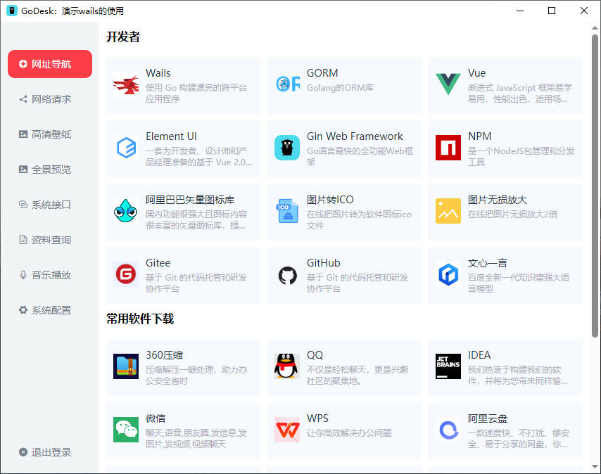
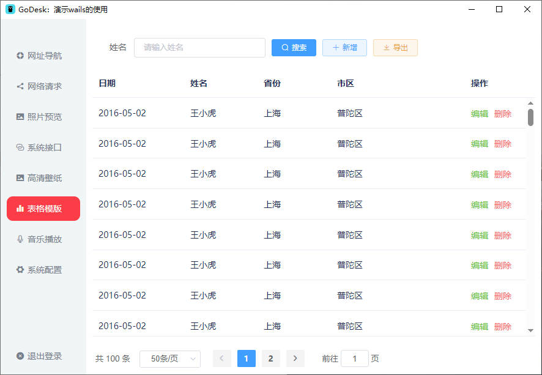
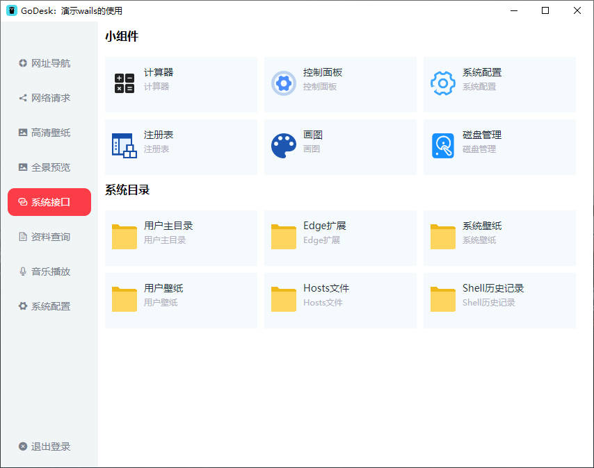
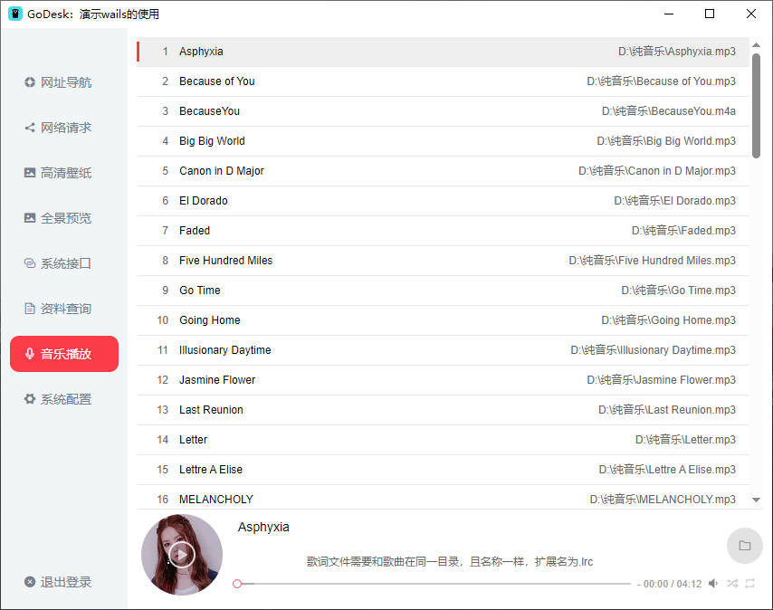
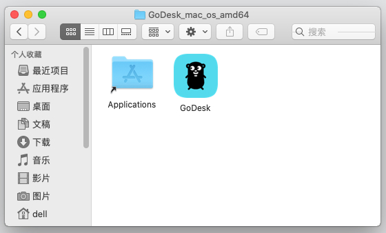
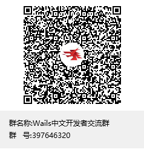

# GoDesk 介绍
>GoDesk 基于Wails2+Vue+Go实现的桌面应用快速开发模板。集成了GinWeb服务、文件上传下载和预览、SQLite数据库操作、应用日志、Windows API使用、系统壁纸设置、Go代码调用、DLL文件使用、ElementUI、Vue 路由、登录、菜单组件等。

下载体验版[github]：https://github.com/xbuntu/godesk/releases  
下载体验版[gitee]：https://gitee.com/xbuntu/godesk/releases

# Wails官方开发手册
>GoDesk 模板只提供了wails部分功能的实现方法，实现更多功能

可参考 **wails** 官方开发手册：https://wails.io/zh-Hans/docs/gettingstarted/installation/

# 预览






# Wails依赖
Wails 有许多安装前需要的常见依赖项：
- Go 1.18+  
- NPM (Node 15+)  

# 开发环境搭建
- 安装 [go](https://studygolang.com/dl)  
- 配置 go 环境变量（参考）

```shell
#/opt/go 替换成 go 安装目录
export GOROOT=/opt/go
export GOPATH=/opt/go/path
export GOBIN=$GOPATH/bin
export GO111MODULE=on
export GOPROXY=https://goproxy.cn,direct
export GOPRIVATE=*.gitlab.com,*.gitee.com,*.github.com
export GOSUMDB=sum.golang.google.cn
export PATH=$PATH:$GOROOT/bin:$GOBIN
```

- 安装 gcc（推荐安装 [TDM-GCC](https://jmeubank.github.io/tdm-gcc/download/) ）  
- 安装 [wails](https://wails.io/zh-Hans/docs/gettingstarted/installation/)  
```shell
go install github.com/wailsapp/wails/v2/cmd/wails@latest
```
- 安装 [nodejs](https://nodejs.org/) 

# 运行命令
Linux 或 Mac 系统构建时，须要保证目录文件有操作权限。再进行编译。官方文档：https://wails.io/zh-Hans/docs/reference/cli
```shell
#如果 frontend/wailsjs 目录不存在，先执行如下命令
wails generate module

#如果首次打包提示 dist目录不存在，先执行下面命令
cd frontend
npm i
npm run build

#检测
wails doctor

#调试
wails dev

#调试遇到错误： failed to find Vite server URL，解决办法：通过指定 frontenddevserverurl 参数
wails dev -frontenddevserverurl "http://localhost:8080"

#打包 .exe
wails build 

#打包 .exe 带安装步骤
wails build -nsis -upx

```
# Linux 和 Mac 系统说明
Mac系统 和 Linux系统兼容问题，可使用如下方法解决：
- 以linux系统为例，可在go代码文件的第一行，加上 //go:build linux 注释，代表当前文件在 linux 环境下有效
- 调试时，可使用：wails dev 命令查看运行错误信息
- 前端可使用 localStorage.getItem("os") 获取操作系统类型，做相应的适配
- 官方手册：https://wails.io/zh-Hans/docs/guides/manual-builds

# Windows打包说明
1. 下载 [nsis](https://nsis.sourceforge.io/Download) 生成带安装步骤的 exe 程序
2. 下载 [upx](https://upx.github.io/) 压缩 exe 程序
3. 运行如下命令
```shell
#生成带安装步骤的程序
wails build -nsis
#生成带安装步骤且压缩过的程序
wails build -nsis -upx
```

# Linux打包和安装方法
- **打包**
1. 移动可执行文件到指定目录
```shell
cp build/bin/GoDesk build/linux/GoDesk/usr/local/bin
```
2. 打包成deb
```shell
dpkg-deb --build build/linux/GoDesk
```
- **安装**
```shell
dpkg -i GoDesk.deb
```

# Mac打包和安装方法
- **打包**
1. 创建 mac 应用程序所在目录的软链接
```shell
sudo ln -s /Applications build/bin/Applications
```
2. 将目录 build/bin 下的 GoDesk.app 和 Applications 一起压缩成 .zip 文件
- **安装**
1. 解压后的文件如图所示
   
2. 将 GoDesk 拖拽到Applications的目录即可
3. 解除安全验证：软件显示禁止符号 或 无法验证软件身份 或 提示已损坏
```shell
sudo xattr -d com.apple.quarantine /Applications/GoDesk.app
```

# go build 说明
```shell
# 使用go build -ldflags "-s -w -H=windowsgui" 生成一个不带cmd窗口的exe文件

go build -ldflags "-s -w -H=windowsgui"

-s 省略符号表和调试信息
-w Omit the DWARF symbol table 省略DWARF符号表
-H windowsgui  不打印信息到console （On Windows, -H windowsgui writes a "GUI binary" instead of a "console binary."），就不会有cmd窗口了
```

# Wails 支持的平台
 - Windows 10/11 AMD64/ARM64
 - MacOS 10.13+ AMD64
 - MacOS 11.0+ ARM64
 - Linux AMD64/ARM64

# 参考网站
- [wails](https://wails.io/zh-Hans/docs/gettingstarted/installation/)  使用 Go 构建漂亮的跨平台应用程序    

- [npm](https://www.npmjs.com/)  Vue包检索网站

- [vue](https://cn.vuejs.org/)  用于构建用户界面的 JavaScript 框架   

- [Element UI](https://element.eleme.io/#/zh-CN/component/installation) 一套为开发者、设计师和产品经理准备的基于 Vue 2.0 的桌面端组件库    

- [upx](https://upx.github.io/)  用于压缩您的应用程序    

- [NSIS](https://nsis.sourceforge.io/Download)  用于生成 Windows 安装程序   

- [Gorm](https://gorm.io/zh_CN/docs/query.html)  go语言orm框架  

- [GoFrame](https://goframe.org/display/gf)  一款模块化、高性能、企业级的Go基础开发框架。    

- [Gin](https://gin-gonic.com/)  Go最快的全功能web框架  

- [golang中文网](https://studygolang.com/dl)  go学习交流平台  

- [TDM-GCC](https://jmeubank.github.io/tdm-gcc/download/)  windows系统 gcc 编译环境

# QQ交流群  


# 支持☕
 - 您可以 **Star** 支持本项目。
